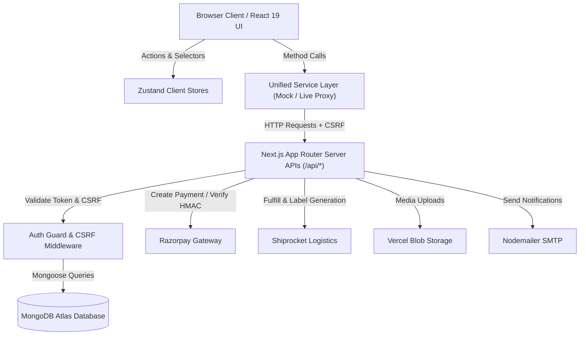
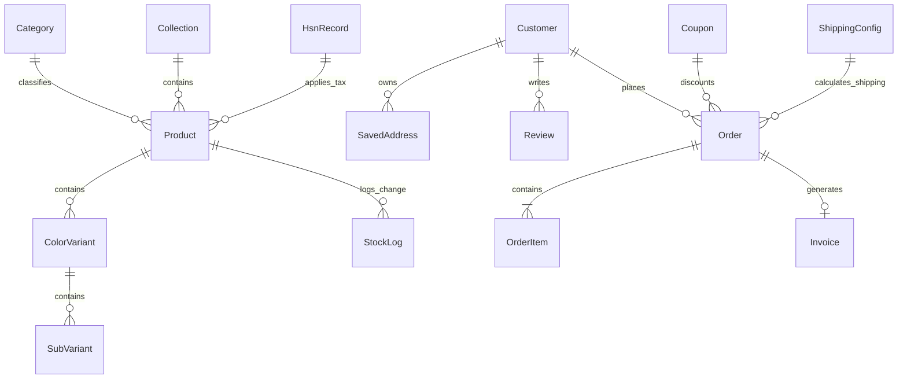
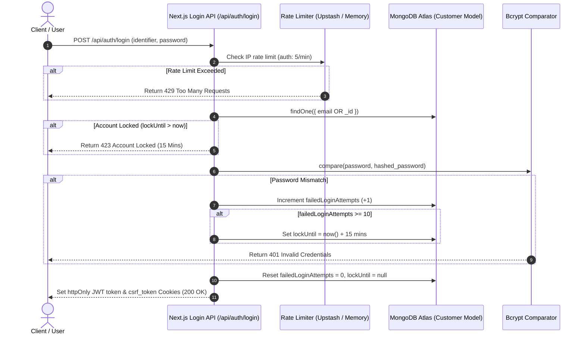
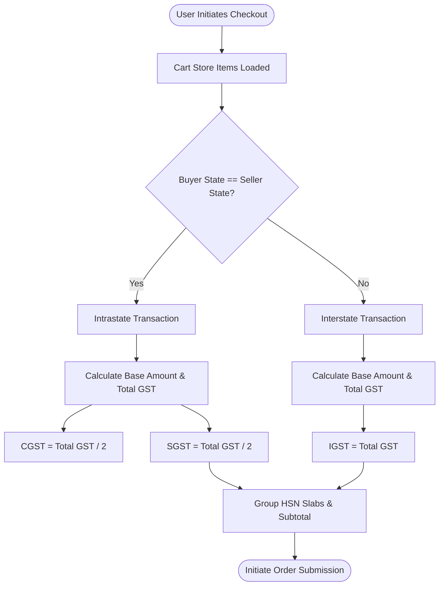
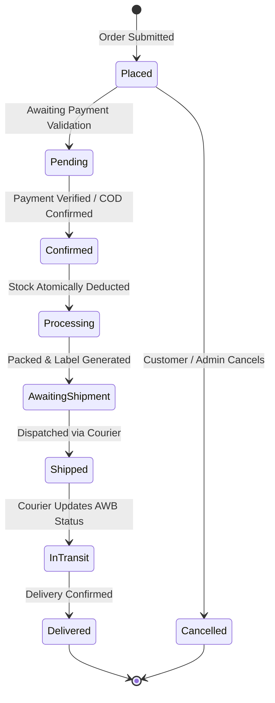
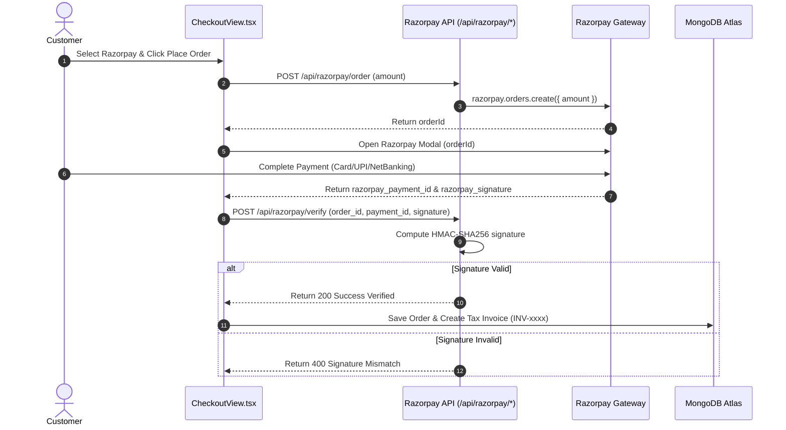
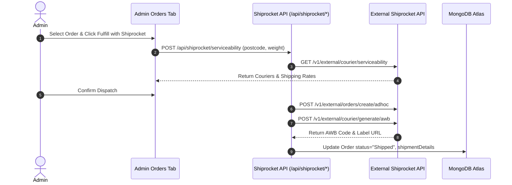

# FlexSell Wholesale — Master Technical Documentation Suite

> **Last Updated:** 2026-07-27T06:26:34.586Z  
> **Application Version:** 0.1.0  
> **Framework:** Next.js 16.2.10 (App Router) | React 19.2.4 | TypeScript 5.0  
> **Database:** MongoDB Atlas (Mongoose ^9.7.4)  
> **Architecture:** Decoupled Unified Service Layer with Offline Sandbox & Live REST APIs  

---

# TABLE OF CONTENTS
1. [PRODUCT OVERVIEW & PERSONA SEGMENTS](#1-product-overview--persona-segments)
2. [TECHNOLOGY STACK INVENTORY](#2-technology-stack-inventory)
3. [SYSTEM ARCHITECTURE & DIAGRAM](#3-system-architecture--diagram)
4. [PROJECT STRUCTURE & FILE LAYOUT](#4-project-structure--file-layout)
5. [APPLICATION ROUTES SPECIFICATION](#5-application-routes-specification)
6. [DATABASE SCHEMA & ERD DIAGRAM (17 MODELS)](#6-database-schema--erd-diagram-17-models)
7. [AUTHENTICATION, LOCKOUT & AUTH FLOW DIAGRAM](#7-authentication-lockout--auth-flow-diagram)
8. [PRODUCT CATALOG & MULTI-TIER PRICING ARCHITECTURE](#8-product-catalog--multi-tier-pricing-architecture)
9. [ATOMIC INVENTORY MANAGEMENT & AUDIT LEDGER](#9-atomic-inventory-management--audit-ledger)
10. [CART & INDIAN GST TAX ENGINE FLOW DIAGRAM](#10-cart--indian-gst-tax-engine-flow-diagram)
11. [ORDER FULFILLMENT STATE MACHINE DIAGRAM](#11-order-fulfillment-state-machine-diagram)
12. [QUOTE ➔ RECEIPT ➔ INVOICE B2B LIFECYCLE DIAGRAM](#12-quote--receipt--invoice-b2b-lifecycle-diagram)
13. [RAZORPAY PAYMENT INTEGRATION & HMAC SEQUENCE DIAGRAM](#13-razorpay-payment-integration--hmac-sequence-diagram)
14. [SHIPROCKET LOGISTICS & FULFILLMENT DIAGRAM](#14-shiprocket-logistics--fulfillment-diagram)
15. [EVENT DISPATCHER & NOTIFICATION FLOW DIAGRAM](#15-event-dispatcher--notification-flow-diagram)
16. [ADMINISTRATIVE DASHBOARD MODULES (18 MODULES)](#16-administrative-dashboard-modules-18-modules)
17. [REST API ENDPOINT REFERENCE (63 ROUTES)](#17-rest-api-endpoint-reference-63-routes)
18. [SERVICES & BUSINESS LOGIC LAYER (14 SERVICES)](#18-services--business-logic-layer-14-services)
19. [STATE MANAGEMENT ARCHITECTURE (14 ZUSTAND STORES)](#19-state-management-architecture-14-zustand-stores)
20. [CONTENT MANAGEMENT SYSTEM (CMS) ARCHITECTURE](#20-content-management-system-cms-architecture)
21. [EXCEL & BULK DATA OPERATIONS](#21-excel--bulk-data-operations)
22. [TESTING STRATEGY & TEST SUITE COVERAGE](#22-testing-strategy--test-suite-coverage)
23. [SECURITY CONTROL MATRIX & CRYPTOGRAPHY](#23-security-control-matrix--cryptography)
24. [DEPLOYMENT, PWA & SYSTEM HEALTH MONITORING](#24-deployment-pwa--system-health-monitoring)
25. [ENVIRONMENT VARIABLES REFERENCE](#25-environment-variables-reference)
26. [ERROR HANDLING ARCHITECTURE](#26-error-handling-architecture)
27. [TROUBLESHOOTING & OPERATIONAL DIAGNOSTICS](#27-troubleshooting--operational-diagnostics)
28. [KNOWN ISSUES & TECHNICAL DEBT ANALYSIS](#28-known-issues--technical-debt-analysis)

---

# 1. PRODUCT OVERVIEW & PERSONA SEGMENTS

FlexSell Wholesale is an all-in-one B2B, B2C, and Dropshipping e-commerce platform engineered specifically for Indian manufacturers, importers, wholesale distributors, and resellers.

## Target Persona Segments
1. **B2B Buyers (Wholesale Merchants):** Bulk pricing tiers, per-variant MOQs, formal quotation requests, and GST tax invoices with buyer GSTINs.
2. **B2C Consumers:** Single-unit retail shopping, instant Razorpay/UPI payments, and shipment tracking.
3. **Dropshippers (Resellers):** Resellers order directly to end-customer shipping addresses with packing slips omitting wholesale cost info.
4. **Platform Administrators:** Inventory management, camera barcode scanning, Shiprocket automated dispatch, and CMS controls.

---

# 2. TECHNOLOGY STACK INVENTORY

| Category | Technology | Version | Purpose |
|:---------|:-----------|:--------|:--------|
| Framework | Next.js (App Router) | 16.2.10 | Full-stack React framework |
| UI Engine | React / React DOM | 19.2.4 | Component rendering |
| Language | TypeScript | ^5 | Type safety across stack |
| Database | MongoDB / Mongoose | ^9.7.4 | Document storage & ODM |
| State Management | Zustand | ^5.0.14 | Scoped client stores |
| Payment Gateway | Razorpay SDK | ^2.9.8 | Online orders & HMAC verification |
| Logistics | Shiprocket Client | Custom | Courier serviceability & AWB labels |
| Rate Limiting | Upstash Redis | ^1.38.0 | Sliding-window API rate limits |
| Testing | Vitest | ^4.1.10 | Unit testing framework |

---

# 3. SYSTEM ARCHITECTURE & DIAGRAM

---

# 4. PROJECT STRUCTURE & FILE LAYOUT

- `src/app/(storefront)` — Public retail and wholesale buyer pages.
- `src/app/(dashboard)/admin` — Administrative management dashboard.
- `src/app/(dashboard)/client` — Customer account & order tracking portal.
- `src/app/api/` — REST API controllers (63 domain routes).
- `src/services/` — Unified client-side service wrappers (14 services).
- `src/stores/` — Zustand client state stores (14 stores).
- `src/models/` — Mongoose schemas for MongoDB (17 schemas).

---

# 5. APPLICATION ROUTES SPECIFICATION

- `/` — Storefront homepage featuring CMS banners, categories, trending products & new arrivals.
- `/products` — Catalog listing with category filters, price sorting, tag search & pagination.
- `/products/[slug]` — Product detail page with variant selector, B2B price tiers, A+ content & JSON-LD schema.
- `/quote` — B2B bulk quotation request form for negotiated wholesale orders.
- `/checkout` — Multi-step checkout with coupon validation, GST calculation & Razorpay payment.
- `/client?view=orders` — Customer order tracking timeline, invoices, receipts & profile settings.
- `/admin` — 18-module administrative dashboard for orders, products, CMS & analytics.
- `/api/health` — System health check monitoring MongoDB connection state.
- `/documentation` — Interactive application documentation portal.

---

# 6. DATABASE SCHEMA & ERD DIAGRAM (17 MODELS)

Active Mongoose Schemas:
1. `Category`
2. `CmsContent`
3. `Collection`
4. `Coupon`
5. `Customer`
6. `HsnRecord`
7. `Inquiry`
8. `Invoice`
9. `Notification`
10. `NotificationPreference`
11. `Order`
12. `OtpVerification`
13. `Product`
14. `PushSubscription`
15. `Review`
16. `ShippingConfig`
17. `StockLog`

## Entity Relationship Diagram (ERD)

---

# 7. AUTHENTICATION, LOCKOUT & AUTH FLOW DIAGRAM

---

# 8. PRODUCT CATALOG & MULTI-TIER PRICING ARCHITECTURE

Products contain nested **Color Variants** and **SubVariants**:
- **SubVariant Matrix:** Size, Weight, MRP, B2C Price, B2B Price, Dropshipping Price, Stock, SKU, Barcode.
- **Price Resolution (`priceTierHelper.ts`):**
  - `B2C`: Applies `b2cPrice`.
  - `B2B`: Applies `b2bPrice` if set and MOQ met, fallback `b2cPrice`.
  - `Dropshipping`: Applies `dropshippingPrice` if set, fallback `b2cPrice`.

---

# 9. ATOMIC INVENTORY MANAGEMENT & AUDIT LEDGER

- Subvariant stock is atomically decremented during checkout via MongoDB `$inc: -quantity` queries.
- Order cancellations trigger matching `$inc: +quantity` restocking updates.
- All manual stock adjustments in Admin Inventory generate a `StockLog` audit ledger entry.

---

# 10. CART & INDIAN GST TAX ENGINE FLOW DIAGRAM

---

# 11. ORDER FULFILLMENT STATE MACHINE DIAGRAM

---

# 12. QUOTE ➔ RECEIPT ➔ INVOICE B2B LIFECYCLE DIAGRAM

---

# 13. RAZORPAY PAYMENT INTEGRATION & HMAC SEQUENCE DIAGRAM

---

# 14. SHIPROCKET LOGISTICS & FULFILLMENT DIAGRAM

---

# 15. EVENT DISPATCHER & NOTIFICATION FLOW DIAGRAM

---

# 16. ADMINISTRATIVE DASHBOARD MODULES (18 MODULES)

18 modules: Overview, Products, Inventory, Orders, Invoices, Categories, Collections, Coupons, Customers, HSN, Reviews, CMS, Shipping Settings, and Theme Customizer.

---

# 17. REST API ENDPOINT REFERENCE (63 ROUTES)

Discovered Route Endpoints:
- `/api/admin/reviews`
- `/api/admin/search`
- `/api/auth/forgot-password`
- `/api/auth/google-login`
- `/api/auth/login`
- `/api/auth/logout`
- `/api/auth/refresh`
- `/api/auth/register`
- `/api/auth/reset-password`
- `/api/auth/send-otp`
- `/api/auth/verify-otp`
- `/api/categories`
- `/api/categories/[id]`
- `/api/cms`
- `/api/collections`
- `/api/collections/slug/[slug]`
- `/api/collections/[id]/products`
- `/api/collections/[id]`
- `/api/coupons`
- `/api/coupons/validate`
- `/api/coupons/[id]`
- `/api/customers/active`
- `/api/customers/addresses`
- `/api/customers`
- `/api/events/dispatch`
- `/api/health`
- `/api/hsn`
- `/api/hsn/[id]`
- `/api/inquiries`
- `/api/inventory/ledger`
- `/api/invoices`
- `/api/invoices/[id]`
- `/api/notifications/preferences`
- `/api/notifications`
- `/api/orders`
- `/api/orders/[id]`
- `/api/orders/[id]/ship`
- `/api/orders/[id]/status`
- `/api/products/bulk`
- `/api/products/export`
- `/api/products/global-highlight-price`
- `/api/products/import`
- `/api/products/new-arrivals`
- `/api/products`
- `/api/products/slug/[slug]`
- `/api/products/trending`
- `/api/products/[id]`
- `/api/push/subscribe`
- `/api/razorpay/order`
- `/api/razorpay/verify`
- `/api/reviews`
- `/api/search`
- `/api/search/suggest`
- `/api/shipping`
- `/api/shiprocket/cancel`
- `/api/shiprocket/config`
- `/api/shiprocket/fulfill`
- `/api/shiprocket/label/[orderId]`
- `/api/shiprocket/serviceability`
- `/api/shiprocket/tracking/[orderId]`
- `/api/shiprocket/webhook`
- `/api/system-diagnostics`
- `/api/upload`

---

# 18. SERVICES & BUSINESS LOGIC LAYER (14 SERVICES)

Active Services:
- `barcodeResolver`
- `categoryService`
- `collectionService`
- `couponService`
- `customerService`
- `hsnService`
- `invoiceService`
- `notificationService`
- `orderService`
- `productService`
- `reviewService`
- `searchService`
- `shippingService`
- `shiprocketService`

---

# 19. STATE MANAGEMENT ARCHITECTURE (14 ZUSTAND STORES)

Active Zustand Stores:
- `authStore`
- `cartStore`
- `categoryStore`
- `collectionStore`
- `confirmStore`
- `dashboardViewStore`
- `hsnStore`
- `inventoryHistoryStore`
- `invoiceStore`
- `orderStore`
- `productStore`
- `themeStore`
- `toastStore`
- `wishlistStore`

---

# 20. CONTENT MANAGEMENT SYSTEM (CMS) ARCHITECTURE

Managed via the `CmsContent` Mongoose key-value model. Stores dynamic content for:
- Hero Marketing Banners & Call-to-Actions
- Category Trust Badges & Announcements
- FAQs, Blogs, Policy Documents & Testimonials
- Footer Links & Contact Info

---

# 21. EXCEL & BULK DATA OPERATIONS

- **CSV/XLSX Bulk Import (`excelParser.ts`):** Allows wholesale admins to upload catalog spreadsheets containing color variants, subvariant matrices, SKUs, and stock levels.
- **Product Export (`excelExporter.ts`):** Generates structured CSV catalog exports for ERP software.

---

# 22. TESTING STRATEGY & TEST SUITE COVERAGE

Vitest automated test suite (`npm run test`) containing 39 passed unit & API integration tests covering:
- `trending.test.ts`: Category-balanced sales volume algorithm
- `searchService.test.ts`: SKU priority search matching & autocomplete
- `auth.test.ts`: JWT token signing, verification & CSRF token hashing
- `endpoints.test.ts`: REST API controllers for registration, login, lockout & password reset

---

# 23. SECURITY CONTROL MATRIX & CRYPTOGRAPHY

- **Content Security Policy (CSP):** Restricts inline script execution.
- **CSRF Token Verification:** Double-submit cookie header check (`X-CSRF-Token`).
- **Account Lockout Protection:** Locks accounts for 15 minutes after 10 consecutive failed password attempts.
- **Credential Encryption:** AES-256-GCM encryption for stored API keys.

---

# 24. DEPLOYMENT, PWA & SYSTEM HEALTH MONITORING

- **Next.js Vercel / Docker Setup:** Server-side component compilation.
- **PWA Service Worker (`public/sw.js`):** Caches offline static assets.
- **Health Check Probe (`/api/health`):** Monitors MongoDB Atlas connection readiness.

---

# 25. ENVIRONMENT VARIABLES REFERENCE

| Variable | Required | Description |
|:---------|:---------|:------------|
| `MONGODB_URI` | Yes | MongoDB Atlas connection string |
| `JWT_SECRET` | Yes | Secret key for signing JWT cookies |
| `NEXT_PUBLIC_SITE_URL` | Yes | Base canonical site URL |
| `RAZORPAY_KEY_ID` | Yes | Razorpay API Key ID |
| `RAZORPAY_KEY_SECRET` | Yes | Razorpay HMAC Secret |
| `SHIPROCKET_EMAIL` | Yes | Shiprocket login credential |
| `SHIPROCKET_PASSWORD` | Yes | Shiprocket login password |
| `UPSTASH_REDIS_REST_URL`| Optional | Sliding window rate limiting Redis URL |

---

# 26. ERROR HANDLING ARCHITECTURE

- **Global React Error Boundaries (`error.tsx`):** Catches uncaught UI rendering exceptions.
- **Structured Server Logger (`logger.ts`):** Logs API errors and external webhook failures.
- **Client Toast Manager (`toastStore`):** Displays user-friendly notification alerts.

---

# 27. TROUBLESHOOTING & OPERATIONAL DIAGNOSTICS

1. **MongoDB Connection Timeouts:** Ensure IP whitelist includes `0.0.0.0/0` on MongoDB Atlas.
2. **Razorpay Signature Mismatch:** Verify `RAZORPAY_KEY_SECRET` matches key secret in Razorpay Dashboard.
3. **Camera Barcode Access:** Ensure HTTPS protocol or `localhost` origin for camera permissions.

---

# 28. KNOWN ISSUES & TECHNICAL DEBT ANALYSIS

- In-memory rate limiting fallback when Upstash Redis is unconfigured.
- Dynamic image domains require explicit configuration in `next.config.ts`.
- Progressive type refinement across older service mock fallbacks.
