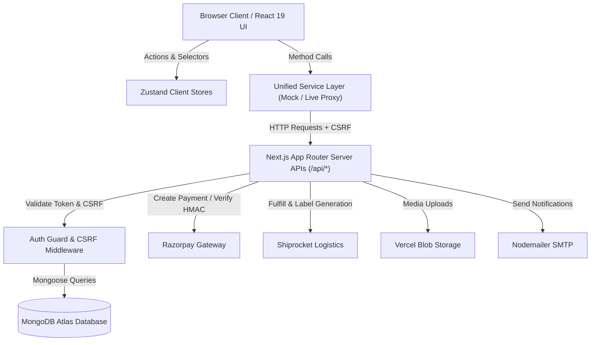
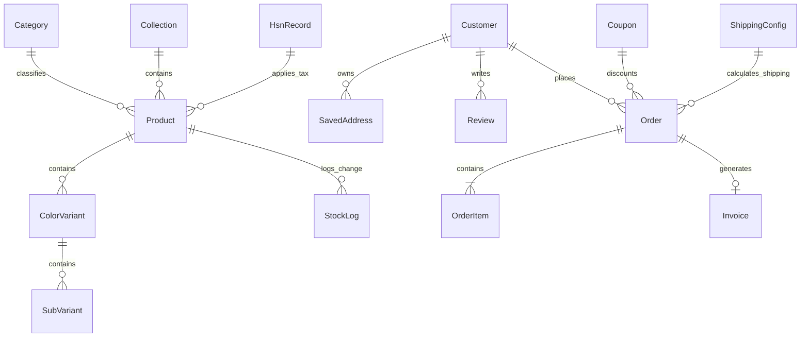
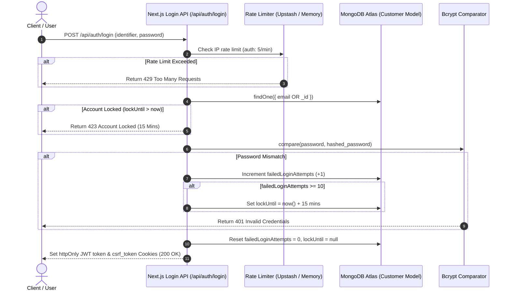
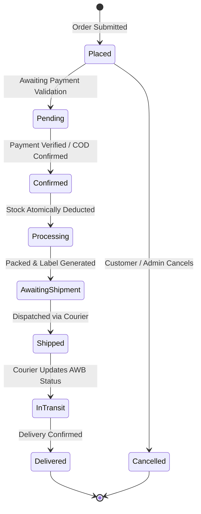
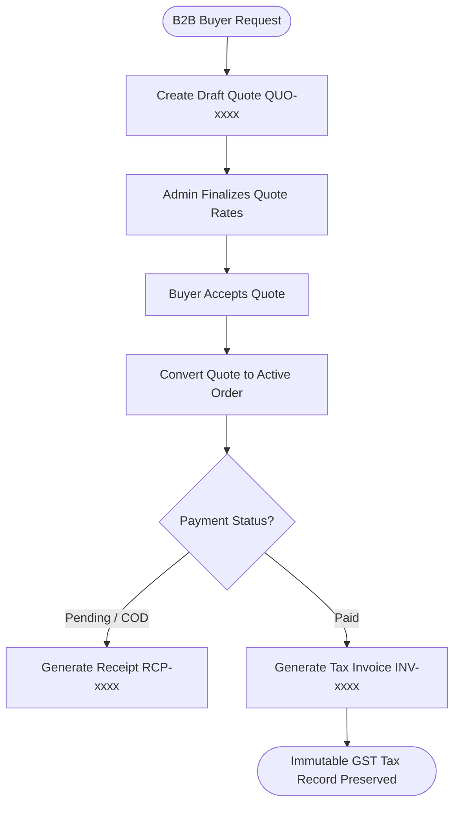
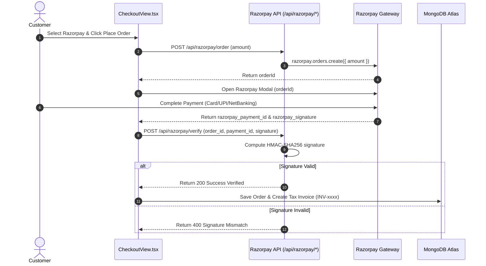
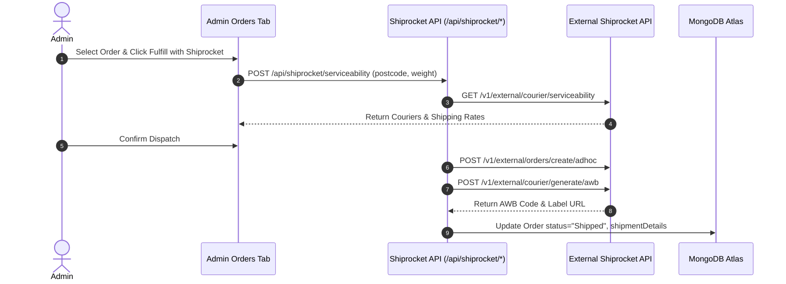
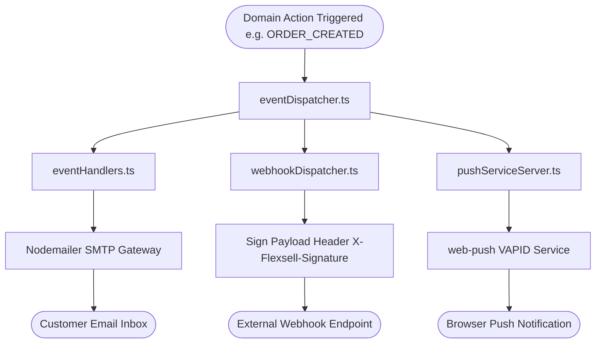

# FlexSell Wholesale — Master Technical Documentation Suite

> **Application Version:** 0.1.0  
> **Framework:** Next.js 16.2.10 (App Router) | React 19.2.4 | TypeScript 5.0  
> **Database:** MongoDB Atlas (Mongoose 9.7.4)  
> **Architecture:** Decoupled Unified Service Layer with Offline Sandbox & Live REST APIs  

---

# TABLE OF CONTENTS
1. [PRODUCT OVERVIEW & PERSONA SEGMENTS](#1-product-overview--persona-segments)
2. [TECHNOLOGY STACK INVENTORY](#2-technology-stack-inventory)
3. [SYSTEM ARCHITECTURE & DIAGRAM](#3-system-architecture--diagram)
4. [PROJECT STRUCTURE & FILE LAYOUT](#4-project-structure--file-layout)
5. [APPLICATION ROUTES SPECIFICATION](#5-application-routes-specification)
6. [DATABASE SCHEMA & ERD DIAGRAM (17 MODELS)](#6-database-schema--erd-diagram-17-models)
7. [AUTHENTICATION, LOCKOUT & AUTH FLOW DIAGRAM](#7-authentication-lockout--auth-flow-diagram)
8. [PRODUCT CATALOG & MULTI-TIER PRICING ARCHITECTURE](#8-product-catalog--multi-tier-pricing-architecture)
9. [ATOMIC INVENTORY MANAGEMENT & AUDIT LEDGER](#9-atomic-inventory-management--audit-ledger)
10. [CART & INDIAN GST TAX ENGINE FLOW DIAGRAM](#10-cart--indian-gst-tax-engine-flow-diagram)
11. [ORDER FULFILLMENT STATE MACHINE DIAGRAM](#11-order-fulfillment-state-machine-diagram)
12. [QUOTE ➔ RECEIPT ➔ INVOICE B2B LIFECYCLE DIAGRAM](#12-quote--receipt--invoice-b2b-lifecycle-diagram)
13. [RAZORPAY PAYMENT INTEGRATION & HMAC SEQUENCE DIAGRAM](#13-razorpay-payment-integration--hmac-sequence-diagram)
14. [SHIPROCKET LOGISTICS & FULFILLMENT DIAGRAM](#14-shiprocket-logistics--fulfillment-diagram)
15. [EVENT DISPATCHER & NOTIFICATION FLOW DIAGRAM](#15-event-dispatcher--notification-flow-diagram)
16. [ADMINISTRATIVE DASHBOARD MODULES (18 MODULES)](#16-administrative-dashboard-modules-18-modules)
17. [REST API ENDPOINT REFERENCE (23 DOMAINS)](#17-rest-api-endpoint-reference-23-domains)
18. [SERVICES & BUSINESS LOGIC LAYER (13 SERVICES)](#18-services--business-logic-layer-13-services)
19. [STATE MANAGEMENT ARCHITECTURE (14 ZUSTAND STORES)](#19-state-management-architecture-14-zustand-stores)
20. [CONTENT MANAGEMENT SYSTEM (CMS) ARCHITECTURE](#20-content-management-system-cms-architecture)
21. [EXCEL & BULK DATA OPERATIONS](#21-excel--bulk-data-operations)
22. [TESTING STRATEGY & TEST SUITE COVERAGE](#22-testing-strategy--test-suite-coverage)
23. [SECURITY CONTROL MATRIX & CRYPTOGRAPHY](#23-security-control-matrix--cryptography)
24. [DEPLOYMENT, PWA & SYSTEM HEALTH MONITORING](#24-deployment-pwa--system-health-monitoring)
25. [ENVIRONMENT VARIABLES REFERENCE](#25-environment-variables-reference)
26. [ERROR HANDLING ARCHITECTURE](#26-error-handling-architecture)
27. [TROUBLESHOOTING & OPERATIONAL DIAGNOSTICS](#27-troubleshooting--operational-diagnostics)
28. [KNOWN ISSUES & TECHNICAL DEBT ANALYSIS](#28-known-issues--technical-debt-analysis)

---

# 1. PRODUCT OVERVIEW & PERSONA SEGMENTS

FlexSell Wholesale is an all-in-one B2B, B2C, and Dropshipping e-commerce platform engineered specifically for Indian manufacturers, importers, wholesale distributors, and resellers.

## Target Persona Segments
1. **B2B Buyers (Wholesale Merchants):** Bulk pricing tiers, per-variant MOQs, formal quotation requests, and GST tax invoices with buyer GSTINs.
2. **B2C Consumers:** Single-unit retail shopping, instant Razorpay/UPI payments, and shipment tracking.
3. **Dropshippers (Resellers):** Resellers order directly to end-customer shipping addresses with packing slips omitting wholesale cost info.
4. **Platform Administrators:** Inventory management, camera barcode scanning, Shiprocket automated dispatch, and CMS controls.

---

# 2. TECHNOLOGY STACK INVENTORY

| Category | Technology | Version | Purpose |
|:---------|:-----------|:--------|:--------|
| Framework | Next.js (App Router) | 16.2.10 | Full-stack React framework |
| UI Engine | React / React DOM | 19.2.4 | Component rendering |
| Language | TypeScript | 5.0+ | Type safety across stack |
| Database | MongoDB / Mongoose | 9.7.4 | Document storage & ODM |
| State Management | Zustand | 5.0.14 | Scoped client stores |
| Payment Gateway | Razorpay SDK | 2.9.8 | Online orders & HMAC verification |
| Logistics | Shiprocket Client | Custom | Courier serviceability & AWB labels |
| Rate Limiting | Upstash Redis | 1.38.0 | Sliding-window API rate limits |
| Testing | Vitest | 4.1.10 | Unit testing framework |

---

# 3. SYSTEM ARCHITECTURE & DIAGRAM

FlexSell Wholesale is organized into 4 distinct architectural layers:

---

# 4. PROJECT STRUCTURE & FILE LAYOUT

- `src/app/(storefront)` — Public retail and wholesale buyer pages.
- `src/app/(dashboard)/admin` — Administrative management dashboard.
- `src/app/(dashboard)/client` — Customer account & order tracking portal.
- `src/app/api/` — REST API controllers (23 domain routes).
- `src/services/` — Unified client-side service wrappers with mock mode support.
- `src/stores/` — Zustand client state stores.
- `src/models/` — 17 Mongoose schemas for MongoDB.

---

# 5. APPLICATION ROUTES SPECIFICATION

- `/` — Storefront homepage featuring CMS banners, categories, trending products & new arrivals.
- `/products` — Catalog listing with category filters, price sorting, tag search & pagination.
- `/products/[slug]` — Product detail page with variant selector, B2B price tiers, A+ content & JSON-LD schema.
- `/quote` — B2B bulk quotation request form for negotiated wholesale orders.
- `/checkout` — Multi-step checkout with coupon validation, GST calculation & Razorpay payment.
- `/client?view=orders` — Customer order tracking timeline, invoices, receipts & profile settings.
- `/admin` — 18-module administrative dashboard for orders, products, CMS & analytics.
- `/api/health` — System health check monitoring MongoDB connection state.

---

# 6. DATABASE SCHEMA & ERD DIAGRAM (17 MODELS)

## Entity Relationship Diagram (ERD)

## Primary Schemas
1. `Customer`: B2C, B2B, Dropshipper accounts, bcrypt passwords, addresses, GSTINs, `failedLoginAttempts`.
2. `Product`: Catalog items, color variants, subvariant matrix (Size x Weight x Price Tiers), HSN codes, barcodes.
3. `Order`: Purchase orders, items, shipping address, payment status (`Pending`, `Paid`), status transitions.
4. `Invoice`: B2B documents: Quotes (`QUO-xxxx`), Receipts (`RCP-xxxx`), and Tax Invoices (`INV-xxxx`).
5. `Category`: Hierarchical taxonomy categories.
6. `Collection`: Manual or smart product groupings.
7. `Coupon`: Discount vouchers (flat/percentage, expiry, minOrderValue).
8. `HsnRecord`: HSN master codes and GST rates.
9. `StockLog`: Inventory movement logs (`productId`, `sku`, `oldStock`, `newStock`, `reason`, `updatedBy`).

---

# 7. AUTHENTICATION, LOCKOUT & AUTH FLOW DIAGRAM

---

# 8. PRODUCT CATALOG & MULTI-TIER PRICING ARCHITECTURE

Products contain nested **Color Variants** and **SubVariants**:
- **SubVariant Matrix:** Size, Weight, MRP, B2C Price, B2B Price, Dropshipping Price, Stock, SKU, Barcode.
- **Price Resolution (`priceTierHelper.ts`):**
  - `B2C`: Applies `b2cPrice`.
  - `B2B`: Applies `b2bPrice` if set and MOQ met, fallback `b2cPrice`.
  - `Dropshipping`: Applies `dropshippingPrice` if set, fallback `b2cPrice`.

---

# 9. ATOMIC INVENTORY MANAGEMENT & AUDIT LEDGER

- Subvariant stock is atomically decremented during checkout via MongoDB `$inc: -quantity` queries.
- Order cancellations trigger matching `$inc: +quantity` restocking updates.
- All manual stock adjustments in Admin Inventory generate a `StockLog` audit ledger entry.

---

# 10. CART & INDIAN GST TAX ENGINE FLOW DIAGRAM

---

# 11. ORDER FULFILLMENT STATE MACHINE DIAGRAM

---

# 12. QUOTE ➔ RECEIPT ➔ INVOICE B2B LIFECYCLE DIAGRAM

---

# 13. RAZORPAY PAYMENT INTEGRATION & HMAC SEQUENCE DIAGRAM

---

# 14. SHIPROCKET LOGISTICS & FULFILLMENT DIAGRAM

---

# 15. EVENT DISPATCHER & NOTIFICATION FLOW DIAGRAM

---

# 16. ADMINISTRATIVE DASHBOARD MODULES (18 MODULES)

18 modules including: Overview, Products, Inventory, Orders, Invoices, Categories, Collections, Coupons, Customers, HSN, Reviews, CMS, Shipping Settings, and Theme Customizer.

---

# 17. REST API ENDPOINT REFERENCE (23 DOMAINS)

- Authentication: `POST /api/auth/register`, `POST /api/auth/login`, `POST /api/auth/logout`, `POST /api/auth/refresh`.
- Products: `GET /api/products`, `POST /api/products`, `POST /api/products/import`, `GET /api/products/export`.
- Orders: `GET /api/orders`, `POST /api/orders`, `PUT /api/orders/[id]/status`.
- Payments: `POST /api/razorpay/order`, `POST /api/razorpay/verify`.
- Logistics: `POST /api/shiprocket/serviceability`, `POST /api/shiprocket/fulfill`, `POST /api/shiprocket/webhook`.
- Diagnostics: `GET /api/health`.

---

# 18. SERVICES & BUSINESS LOGIC LAYER (13 SERVICES)

Unified service layer: `productService`, `orderService`, `customerService`, `invoiceService`, `categoryService`, `collectionService`, `couponService`, `reviewService`, `searchService`, `hsnService`, `shippingService`, `shiprocketService`, `notificationService`.

---

# 19. STATE MANAGEMENT ARCHITECTURE (14 ZUSTAND STORES)

Stores: `cartStore`, `authStore`, `productStore`, `orderStore`, `invoiceStore`, `categoryStore`, `collectionStore`, `hsnStore`, `inventoryHistoryStore`, `themeStore`, `wishlistStore`, `toastStore`, `confirmStore`, `dashboardViewStore`.

---

# 20. CONTENT MANAGEMENT SYSTEM (CMS) ARCHITECTURE

CMS Content Key-Value Store (`CmsContent`) managing hero banners, FAQs, trust stats, footers, blogs, testimonials, and policy documents.

---

# 21. EXCEL & BULK DATA OPERATIONS

CSV/XLSX product import (`excelParser.ts`), product export (`excelExporter.ts`), and printable B2B catalog sheets with QR codes.

---

# 22. TESTING STRATEGY & TEST SUITE COVERAGE

Vitest test suites (`src/lib/__tests__/` and `src/app/api/auth/__tests__/`) covering auth JWTs, search matching, trending calculation, and REST endpoints.

---

# 23. SECURITY CONTROL MATRIX & CRYPTOGRAPHY

CSP headers, double-submit CSRF tokens, Upstash Redis sliding-window rate limiting, bcrypt password hashing, and AES-256-GCM encryption for credentials.

---

# 24. DEPLOYMENT, PWA & SYSTEM HEALTH MONITORING

Vercel / Docker build setup, PWA service worker (`public/sw.js`), and `/api/health` monitoring probe.

---

# 25. ENVIRONMENT VARIABLES REFERENCE

`MONGODB_URI`, `JWT_SECRET`, `NEXT_PUBLIC_SITE_URL`, `RAZORPAY_KEY_ID`, `RAZORPAY_KEY_SECRET`, `SHIPROCKET_EMAIL`, `SHIPROCKET_PASSWORD`, `UPSTASH_REDIS_REST_URL`.

---

# 26. ERROR HANDLING ARCHITECTURE

React Global Error Boundaries (`error.tsx`), structured Sentry logging (`logger.ts`), and user toast alerts (`toastStore`).

---

# 27. TROUBLESHOOTING & OPERATIONAL DIAGNOSTICS

Step-by-step procedures for MongoDB SRV timeouts, Razorpay signature mismatches, camera permissions, and HMR dev warnings.

---

# 28. KNOWN ISSUES & TECHNICAL DEBT ANALYSIS

In-memory rate limiter fallback in multi-instance environments, dynamic image allowlists, local disk upload fallbacks, and progressive type refinement.
